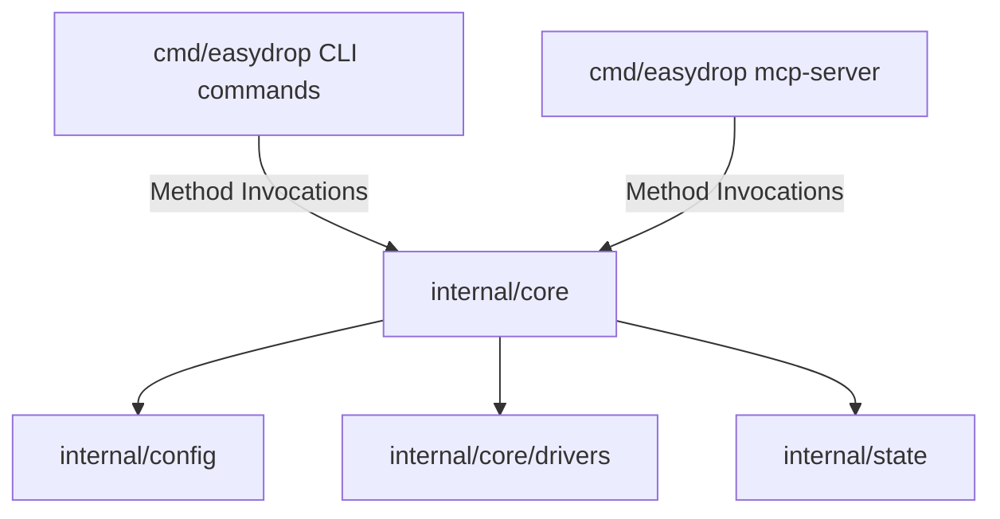

# Architecture Specification – EasyDrop

## 1. Architectural Pattern (One Core, Two Interfaces)
The system is strictly decoupled into an isolated core business logic layer (`internal/core`) and two independent user-facing interfaces (the terminal CLI and the JSON-RPC MCP Server). The core remains entirely agnostic of the interface initiating the execution request and returns strongly-typed Go structural data.



Single binary: `cmd/easydrop/main.go` exposes both CLI (cobra) and
MCP server (`easydrop mcp-server` switches the binary into JSON-RPC stdio mode).

## 2. Repository Structure
```text
easydrop/
├── cmd/
│   └── easydrop/             # Single binary entry point (CLI + `mcp-server` subcommand)
├── internal/
│   ├── config/               # Validation and parsing engines for easydrop.toml
│   ├── state/                # Deployment state manager (Source of Truth)
│   ├── models/               # Domain Models and shared data structures
│   └── core/                 # Core business logic layer
│       ├── bootstrapper/     # Environment verification and Docker/Compose provisioning
│       ├── builder/          # Image compilation pipelines (Local/Remote blueprints)
│       ├── drivers/          # Orchestration drivers (Solo, Compose, Swarm structures)
│       └── infra/            # Ingress management (Nginx & Certbot operations)
├── templates/                # Systemic configuration blueprints (Nginx, Compose templates)
└── pkg/                      # Generic utility packages and shared toolsets
```

## 3. State Management & Idempotency
Because EasyDrop functions as a stateless CLI utility without a persistent daemon running on the user's local machine, tracking and anchoring active infrastructure state occurs directly on the targeted remote host.

1. **Source of Truth:** A dedicated runtime file is maintained natively on the target host filesystem under the path `~/.easydrop/state/[app_name].json` to lock operational states.
2. **Fault Tolerance & Rollbacks:** When executing rolling updates via the Solo driver, the engine spins up the incoming container on an ephemeral transient port first, kicks off network validation loops (Health Checks), and safely tears down the legacy active container *only* after ensuring successful staging handshakes and updating active Nginx upstream configurations.

## 4. Drivers Interface Specification
Every custom container orchestration module must conform strictly to a unified structural contract written in Go (locked – `Deploy` takes only `*models.Application`; `Logs` covers both MCP slice via channel close and CLI `tail -f` streaming):

```go
package drivers

import (
	"context"
	"easydrop/internal/models"
)

type DeploymentDriver interface {
	Deploy(ctx context.Context, app *models.Application) error
	Status(ctx context.Context, appName string) (*models.AppStatus, error)
	Logs(ctx context.Context, appName string, lines int, follow bool) (<-chan string, error)
	Teardown(ctx context.Context, appName string) error
}

// CommandExecutor abstracts local vs remote (SSH) host operations.
// Close() is mandatory to avoid SSH/SFTP connection leaks.
// Nginx configs are staged via UploadFile to /tmp/easydrop/ and moved
// atomically with `sudo mv` – never written directly to /etc/nginx.
// Certbot without email uses --register-unsafely-without-email.
type CommandExecutor interface {
	ExecCommand(ctx context.Context, cmd string) (stdout, stderr string, exitCode int, err error)
	UploadFile(ctx context.Context, srcPath, destPath string) error
	Close() error
}
```

`models.Application` is the compiled runtime context (`{ Config *Config }`) passed through the core; `models.AppStatus{ Status, Uptime, SSLStatus }` is the `Status` return type. Full field map (`HealthCheckPath` default `/`, `Build.Registry/Image/NoCache`, `Driver.ComposeFile` default `docker-compose.yml`, `Nginx.Email` optional) lives in `internal/models/types.go` and `docs/implementation.md §1`.

## 5. Locked Tech Decisions

| # | Decision | Choice | Why |
|---|----------|--------|-----|
| 1 | Distribution | Single binary `cmd/easydrop/main.go`; MCP mode = `easydrop mcp-server` (stdio) | Two binaries complicate cross-compilation and distribution (NFR-03) |
| 2 | TOML | `github.com/pelletier/go-toml/v2` | Struct tagging, strict type validation at parse time, JSON-schema generation for the MCP `easydrop://docs/schema` resource |
| 3 | CLI framework | `cobra`, no `viper` | Industry standard for CLI; `viper` is overkill – all config lives in one `easydrop.toml`, cobra flags suffice |
| 4 | MCP SDK | Official `modelcontextprotocol/go-sdk` | Most stable, maintained, lightweight Go SDK; maps core methods to JSON-RPC tools for LLMs |
| 5 | Config scope | Extended `Config` (registry / healthcheck / compose fields) | Avoids uncovered requirements: FR-04 local build needs `Registry/Image/NoCache`, FR-12 needs `HealthCheckPath`, FR-06 needs `ComposeFile` |
| 6 | Toolchain | Go ≥ 1.27 (`go 1.27` in `go.mod`; system SDK `~/go/go1.27.1` first on `PATH`) | Latest stable at setup; `x/crypto` needs ≥ 1.26 |
```
